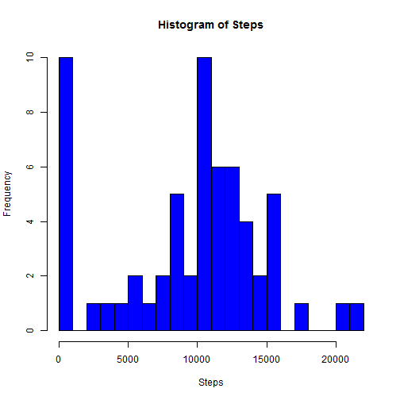
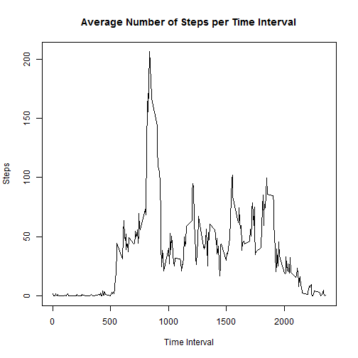
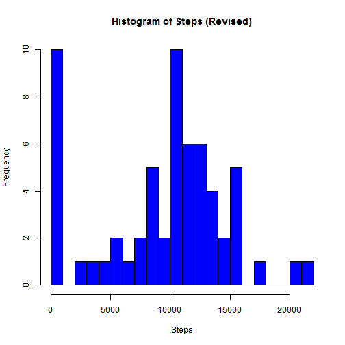

# Reproducible Research: Peer Assessment 1
# Craig Lewis
# June 15, 2015

## Loading and preprocessing the data

```r
library(dplyr)
library(xtable)
step<-read.csv("activity.csv")
```

## What is mean total number of steps taken per day?

```r
# summarize data & fixup column name
date_table<-summarise(group_by(step,date),sum(steps,na.rm=TRUE))
names(date_table)[2]<-"StepSum"
#output table by day
dt<-xtable(date_table)
print ("Number of steps taken each day:")
```

[1] "Number of steps taken each day:"

```r
print(dt,type="html")
```

<!-- html table generated in R 3.1.2 by xtable 1.7-4 package -->
<!-- Sat Jun 13 11:30:01 2015 -->
<table border=1>
<tr> <th>  </th> <th> date </th> <th> StepSum </th>  </tr>
  <tr> <td align="right"> 1 </td> <td> 2012-10-01 </td> <td align="right">   0 </td> </tr>
  <tr> <td align="right"> 2 </td> <td> 2012-10-02 </td> <td align="right"> 126 </td> </tr>
  <tr> <td align="right"> 3 </td> <td> 2012-10-03 </td> <td align="right"> 11352 </td> </tr>
  <tr> <td align="right"> 4 </td> <td> 2012-10-04 </td> <td align="right"> 12116 </td> </tr>
  <tr> <td align="right"> 5 </td> <td> 2012-10-05 </td> <td align="right"> 13294 </td> </tr>
  <tr> <td align="right"> 6 </td> <td> 2012-10-06 </td> <td align="right"> 15420 </td> </tr>
  <tr> <td align="right"> 7 </td> <td> 2012-10-07 </td> <td align="right"> 11015 </td> </tr>
  <tr> <td align="right"> 8 </td> <td> 2012-10-08 </td> <td align="right">   0 </td> </tr>
  <tr> <td align="right"> 9 </td> <td> 2012-10-09 </td> <td align="right"> 12811 </td> </tr>
  <tr> <td align="right"> 10 </td> <td> 2012-10-10 </td> <td align="right"> 9900 </td> </tr>
  <tr> <td align="right"> 11 </td> <td> 2012-10-11 </td> <td align="right"> 10304 </td> </tr>
  <tr> <td align="right"> 12 </td> <td> 2012-10-12 </td> <td align="right"> 17382 </td> </tr>
  <tr> <td align="right"> 13 </td> <td> 2012-10-13 </td> <td align="right"> 12426 </td> </tr>
  <tr> <td align="right"> 14 </td> <td> 2012-10-14 </td> <td align="right"> 15098 </td> </tr>
  <tr> <td align="right"> 15 </td> <td> 2012-10-15 </td> <td align="right"> 10139 </td> </tr>
  <tr> <td align="right"> 16 </td> <td> 2012-10-16 </td> <td align="right"> 15084 </td> </tr>
  <tr> <td align="right"> 17 </td> <td> 2012-10-17 </td> <td align="right"> 13452 </td> </tr>
  <tr> <td align="right"> 18 </td> <td> 2012-10-18 </td> <td align="right"> 10056 </td> </tr>
  <tr> <td align="right"> 19 </td> <td> 2012-10-19 </td> <td align="right"> 11829 </td> </tr>
  <tr> <td align="right"> 20 </td> <td> 2012-10-20 </td> <td align="right"> 10395 </td> </tr>
  <tr> <td align="right"> 21 </td> <td> 2012-10-21 </td> <td align="right"> 8821 </td> </tr>
  <tr> <td align="right"> 22 </td> <td> 2012-10-22 </td> <td align="right"> 13460 </td> </tr>
  <tr> <td align="right"> 23 </td> <td> 2012-10-23 </td> <td align="right"> 8918 </td> </tr>
  <tr> <td align="right"> 24 </td> <td> 2012-10-24 </td> <td align="right"> 8355 </td> </tr>
  <tr> <td align="right"> 25 </td> <td> 2012-10-25 </td> <td align="right"> 2492 </td> </tr>
  <tr> <td align="right"> 26 </td> <td> 2012-10-26 </td> <td align="right"> 6778 </td> </tr>
  <tr> <td align="right"> 27 </td> <td> 2012-10-27 </td> <td align="right"> 10119 </td> </tr>
  <tr> <td align="right"> 28 </td> <td> 2012-10-28 </td> <td align="right"> 11458 </td> </tr>
  <tr> <td align="right"> 29 </td> <td> 2012-10-29 </td> <td align="right"> 5018 </td> </tr>
  <tr> <td align="right"> 30 </td> <td> 2012-10-30 </td> <td align="right"> 9819 </td> </tr>
  <tr> <td align="right"> 31 </td> <td> 2012-10-31 </td> <td align="right"> 15414 </td> </tr>
  <tr> <td align="right"> 32 </td> <td> 2012-11-01 </td> <td align="right">   0 </td> </tr>
  <tr> <td align="right"> 33 </td> <td> 2012-11-02 </td> <td align="right"> 10600 </td> </tr>
  <tr> <td align="right"> 34 </td> <td> 2012-11-03 </td> <td align="right"> 10571 </td> </tr>
  <tr> <td align="right"> 35 </td> <td> 2012-11-04 </td> <td align="right">   0 </td> </tr>
  <tr> <td align="right"> 36 </td> <td> 2012-11-05 </td> <td align="right"> 10439 </td> </tr>
  <tr> <td align="right"> 37 </td> <td> 2012-11-06 </td> <td align="right"> 8334 </td> </tr>
  <tr> <td align="right"> 38 </td> <td> 2012-11-07 </td> <td align="right"> 12883 </td> </tr>
  <tr> <td align="right"> 39 </td> <td> 2012-11-08 </td> <td align="right"> 3219 </td> </tr>
  <tr> <td align="right"> 40 </td> <td> 2012-11-09 </td> <td align="right">   0 </td> </tr>
  <tr> <td align="right"> 41 </td> <td> 2012-11-10 </td> <td align="right">   0 </td> </tr>
  <tr> <td align="right"> 42 </td> <td> 2012-11-11 </td> <td align="right"> 12608 </td> </tr>
  <tr> <td align="right"> 43 </td> <td> 2012-11-12 </td> <td align="right"> 10765 </td> </tr>
  <tr> <td align="right"> 44 </td> <td> 2012-11-13 </td> <td align="right"> 7336 </td> </tr>
  <tr> <td align="right"> 45 </td> <td> 2012-11-14 </td> <td align="right">   0 </td> </tr>
  <tr> <td align="right"> 46 </td> <td> 2012-11-15 </td> <td align="right">  41 </td> </tr>
  <tr> <td align="right"> 47 </td> <td> 2012-11-16 </td> <td align="right"> 5441 </td> </tr>
  <tr> <td align="right"> 48 </td> <td> 2012-11-17 </td> <td align="right"> 14339 </td> </tr>
  <tr> <td align="right"> 49 </td> <td> 2012-11-18 </td> <td align="right"> 15110 </td> </tr>
  <tr> <td align="right"> 50 </td> <td> 2012-11-19 </td> <td align="right"> 8841 </td> </tr>
  <tr> <td align="right"> 51 </td> <td> 2012-11-20 </td> <td align="right"> 4472 </td> </tr>
  <tr> <td align="right"> 52 </td> <td> 2012-11-21 </td> <td align="right"> 12787 </td> </tr>
  <tr> <td align="right"> 53 </td> <td> 2012-11-22 </td> <td align="right"> 20427 </td> </tr>
  <tr> <td align="right"> 54 </td> <td> 2012-11-23 </td> <td align="right"> 21194 </td> </tr>
  <tr> <td align="right"> 55 </td> <td> 2012-11-24 </td> <td align="right"> 14478 </td> </tr>
  <tr> <td align="right"> 56 </td> <td> 2012-11-25 </td> <td align="right"> 11834 </td> </tr>
  <tr> <td align="right"> 57 </td> <td> 2012-11-26 </td> <td align="right"> 11162 </td> </tr>
  <tr> <td align="right"> 58 </td> <td> 2012-11-27 </td> <td align="right"> 13646 </td> </tr>
  <tr> <td align="right"> 59 </td> <td> 2012-11-28 </td> <td align="right"> 10183 </td> </tr>
  <tr> <td align="right"> 60 </td> <td> 2012-11-29 </td> <td align="right"> 7047 </td> </tr>
  <tr> <td align="right"> 61 </td> <td> 2012-11-30 </td> <td align="right">   0 </td> </tr>
   </table>

```r
#print histogram
hist(date_table$StepSum,breaks=30,xlab="Steps",main="Histogram of Steps",col="blue")
```

 

```r
#calculate mean & median
daily_mean <- round(mean(date_table$StepSum),2)
daily_median<-median(date_table$StepSum)
```

The mean total number of steps taken per day is 9354.23 steps. The median number of steps is 10395 steps.

## What is the average daily activity pattern?

```r
## Summarize this time on the intervals
time_table<-summarise(group_by(step,interval),mean(steps,na.rm=TRUE))
names(time_table)[2]<-"IntervalAvg"
## Plot steps by interval
plot(time_table$interval,time_table$IntervalAvg,type="l",xlab="Time Interval",ylab="Steps",main="Average Number of Steps per Time Interval")
```

 

```r
# Find the maximum row 
max_int_row<-which.max(time_table$IntervalAvg)
max_avg_steps<-time_table[max_int_row,]$IntervalAvg
max_avg_interval<-time_table[max_int_row,]$interval
```
The maximum interval where the most number of steps occur is  835 with 206.1698113 steps taken.

## Imputing missing values

```r
## How many NA values? 
step_na<-sum(is.na(step$steps))

## Build out new data frame of daily steps replacing NAs with mean value for each day
## [N.B. There has to be a better way to do this :( )]

#new data structure for values
interp_date_table<-summarise(group_by(step,date),0)
names(interp_date_table)[2]<-"mean"
interp_date_table<-cbind(interp_date_table,rep(0,nrow(date_table)))
names(interp_date_table)[3]<-"median"
interp_date_table<-cbind(interp_date_table,rep(0,nrow(date_table)))
names(interp_date_table)[4]<-"sum"

# go through each day, subset out dates, calculate mean for that day (some are NaNs so we fix those) then assign to 
# our new data structure
for (i in 1:nrow(date_table)) {
    thisday<-date_table[i,]
    thisdayvalues<-subset(x=step, subset = date==thisday$date)
    # get the mean and if it is not a number, make it 0
    thisdaymean<-mean(thisdayvalues$steps,na.rm=TRUE)
    if(is.nan(thisdaymean)) {thisdaymean<-0}
    
    # calculate the median too
    thisdaymedian<-median(thisdayvalues$steps,na.rm=TRUE)
    if(is.nan(thisdaymedian)) {thisdaymedian<-0}
    
    #assign the mean to the NA vaslues
    na_val<-is.na(thisdayvalues$steps)
    thisdayvalues[na_val,1]<-thisdaymean
    # and add it to the data structure    
    interp_date_table[i,2]<-mean(thisdayvalues$steps)
    interp_date_table[i,3]<-median(thisdayvalues$steps)
    interp_date_table[i,4]<-sum(thisdayvalues$steps)
    
    }
```
There are 2304 NA values for the variable 'step' in the input file. 

This is a table of the daily mean and daily median number of steps taken for each day. For the median it appears that because so many of the readings are 0 that the median number of steps is 0.


Here is a new histogram of the number of steps taken per day replacing the NA values from the input data set with the mean value of each day in which the NA value appeared. There is no real difference to the shape of the histogram. 


```r
hist(interp_date_table$sum,breaks=30,xlab="Steps",main="Histogram of Steps (Revised)",col="blue")
```

 

Looking more closely at the data, there are a number of days where the overwhelming number of measurements are 0. This drives the median down to 0 for all days. Also, the days in which NAs appear, they appear almost always throughout the entire day so that replacing them with the value 0 has the same affect as using the rm.na=TRUE parameter does when summing up the days.


## Are there differences in activity patterns between weekdays and weekends?


```r
# Create Factor variable for Day of Week

DoW<-factor(c("Weekend","Weekday"))


# Now we know which are weekends and which are weekdays
```


